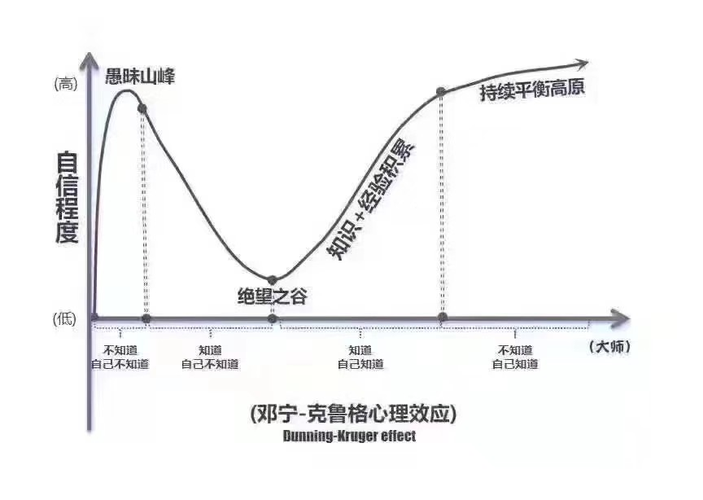

# 进入大学的心态准备

作者：@zgq354

前面的章节，对大学在学习方面所面临的严峻现实，及计算机学生破局可以加以利用的一些资源，做了一个基本的勾勒。这一小节，主要也是展开聊聊，作为一名大学生，在心态上需要做好的准备。

也如上一节关于知识网络的描述所言，这一切的出发点也在于，保持一种 **对理性、科学知识的虔诚，以及对真理的不懈追求**，还有始终积极主动的心态。具体展开而言，大致可以是这几个主题：

1. 独立面对
2. 理想与现实的平衡
3. 对未知探索建立信心
4. 信息爆炸的应对
5. 总结与沉淀的意识
6. 多多交流，走向共同面对

## 逐渐适应「独立面对」的状态

前面章节有提到，学习与成长是自己的事情。世界并不是理想的小滑块，未来的你可能会有许多不尽人意的事，但没有任何人有义务和能力去为你化解这些事情，帮你背负成长的责任。**独立面对**，去适应身边的环境，付诸行动解决自身的困惑和问题，争取让自己的收获最大化，某种意义上也是你当下的唯一选择。

如《被讨厌的勇气》提到的“课题分离”原则一般，每个人都有属于自己的人生课题，许多的问题和烦恼，也是来源于你自己的课题被加以干涉，或将自己的课题强加于他人。独立面对，意味着自己需要获得自己人生课题的主动权，不再幻想问题会自动消失，并付出现实的行动。

这也是从中小学时期普遍的「被动灌输」到大学生应有的「主动探索」状态的第一步转变。

## 理想与现实的平衡

在独立面对的原则下，在日常的活动中，给自己留下专注与思考的空间，把握好自我与外界接触的平衡，也变得重要了起来。

现实并不完美，我们在探索这个不完美世界的过程中，常会遇到许多迫不得已要花时间做的事情。如《上海交大学生生存手册》中举的例子：效率低下的课、毫无组织的集体活动、难以推脱的临时工作等等。若没有自我的主动，在不太理想的环境里，容易因为人云亦云，陷入各种细枝末节的琐碎中，难以解脱。

当然，这样的现象也有其现实背景。如第一节所言，大学“土壤”的建设背后是大量资金投入，类似欧美相对理想的大学氛围，背后需要的费用是不菲的，本科阶段需要付出20万美元上下<small>（数据还待补充）</small>；大陆高校的建设费用，更多来自于国家的教育经费投入、科研收入、教育培训收入等，一般本科生学杂费住宿费加起来基本在5万人民币上下（部分学校可能10万左右），与欧美等高校相比而言并不在一个量级。更多时候我们是接收到了相对更普惠的高等教育，体验上很难抱太多理想的预期。

如前面章节所言，遇到问题，并不意味着只能默默忍受，接纳现实的同时，从资源、氛围来看还是有机会破局的：

1. 学习资源：结合互联网与开源社区，可以实现课内安排课外学习的双线并行
2. 氛围：利用个体必然的局限性与信息差，构建起志同道合的学习小组

我们的社区也正是如此的定位，希望可以在资源和氛围视角，在线上创造一个相对理想的形态，并为之提供行之有效的方法，可以支撑起这个领域的学习。

当然互联网并不能代替生活的全部，理想没有一个现实的触达，只会停留在空中楼阁里停滞和闭塞。于我们而言，面对各自的现实生活，有很多问题需要考虑。

一方面是时间计划的平衡，考虑相对理想的在线课程与现实可能不是太完美的授课的一个结合，如果有机会，尽可能多与身边任课老师，辅导员沟通交流自己的计划，寻求行政层面的支撑和减小阻力。总的而言，至少应保证 GPA 在一定水平，避免不必要的挂科，影响未来的选择。

另一方面是关注线下氛围的构建，而非停留在互联网上，无论学习、生活、工作，若身边能有一些伙伴相互支撑，会是更好的状态。

## 对未知探索保持信心

### 面对未知的勇气

计算机领域的学习与工作中，经常需要一种学习新事物的状态。我们过去的应试教育压力下的成长中，许多事情早已有安排，可以给到预期说“完成本课程，一定会学会”。但对于课本和老师讲解预期之外的东西，常常是一个不敢行动、缺乏勇气独立承担选择带来的风险的状态。

在这样的背景影响下，在面对一个新的未知领域的开始，有的人可能下意识就打起了退堂鼓，因为听说某些只言片语，提前下了一个结论：“这个好难啊，我肯定不懂”，否定了进一步的可能性。这也是一个常见的现象，在老舍的《四世同堂》中有一段类似的描述：

> 生在某一种文化中的人，未必知道那个文化是什么，像水中的鱼似的，他不能跳出水外去看清楚那是什么水。假若他自己不能完全客观的去了解自己的文化，那能够客观的来观察的旁人，又因为生活在这种文化以外，就极难咂摸到它的滋味，而往往因一点胭脂，断定他美，或几个麻斑而断定他丑。

关于某个新领域“难”与“不难”的判断，也常因为这样的下意识恐惧而断定了。也恰恰是这样的断定，而让我们拒绝了许多东西，否定了人生更多的可能性。小学时我们便学过 [“小马过河”](https://www.ppzuowen.com/book/baobaoshuiqiangushidaquanji/164357.html) 的故事，但可惜的是，到了大学，我们许多人仍然还继续犯着类似的谬误。

这样的自信不足，主要来源于个体对陌生事物的 **“不配得感”**，主要因为身份认同的因素而下意识 “画地为牢” 的心态。实际上来说，我们学习东西，总会有一个自信心逐步崩塌，从迷雾中逐步走出的过程，这个现象有个概念是 “邓宁·克鲁格心理效应”，对应如图的曲线所描述的模型。

这其实是一个正常现象，面临恐惧，最好的办法还是增加信息量。在计算机领域，Web 与开源社区，也在克服恐惧所需信息方面给了我们非常强大的底气，理论上来说，我们不应该失去信心的。

道理都懂，要真正地达成，有时可能还需要一个体悟的过程。于新手而言，可以尝试去挑战一些难度相对较轻的任务，多经历和感受几次从绝望之谷慢慢走出来的感觉，给自己多一点勇气；勇气的逐步积累下，自身的一些 “面对未知的霸气” 的 “学霸” 气质也因此得以培育起来。

关于“学霸”的“重新定义”，可以看 Bintou 老师的帖子 [“你是否需要做学霸？”](https://0xffff.one/d/60-ni-shi-fou-xu-yao-zuo-xue-ba)。

### 打破 Peer Pressure

上述的 “不配得感” 还伴生了另一个较普遍的心理现象，在于 Peer Pressure 带来的压迫感。

过去中小学强调面向学习资源竞争的学习中，我们常常需要和周围的人比较，以排名来判断“进步”/“退步”，也以成绩排名的方式，去区分班级、老师的重视程度等。以至于当身边有同学取得了某种成就，心中不觉也带来一种“地位被挑战”的压迫感。

这样的压迫感也使很多人难再有一颗开放分享的心态，亦或是被“打击”之下的压抑感觉，长此以往，带来的更多的是上述持续的不自信。在不自信的状态下，萌生的想法也常常因为自我怀疑而内耗在了心里，而不见行动。没有行动就没有改变，更加剧了这样的压抑感，于是进入了一个恶性循环。

大学中这样的压迫感并不必要，脱离了中小学的竞争体系后，实际上相比于类似高考、考研、保研的切蛋糕游戏而言，更需要的是一种多方共赢的思维，把蛋糕做大。

打开视野，大学的出路并非只有考研、保研等固定的赛道，每个人都拥有自己的独特，换句话说每个人都是自己的 No.1。即使看似懂很多的人，也未必能够面面俱到，可能唯一的优势在于他获得了某些现实赛道认可下带来的自信心。在这个背景下，不自信更多时候是自己给自己的一点“幻象”带来的枷锁。

一切的核心在于内心出发行动的积累，不妨给自己多一些沉住气的空间，接纳你的学习可能并不总是那么立竿见影的现实。如「冰山模型」，当你积累到一定程度，突破到了水面上可以被他人看见的程度的时候，收获现实中所谓赛道的认可，只是降维打击下的顺便事情。也许有机会你还可以创造出更多的“赛道”呢。

更多的讨论可见：[关于同辈压力 (Peer Pressure)](https://0xffff.one/d/610-guan-yu-tong-bei-ya-li-peer-pressure)

当你足够自信地表达自我时，别忘了给身边可能陷入 Peer Pressure 幻象的人，多传递一些鼓励和信心。

## 信息爆炸的应对

如 [知识网络与分工](https://wiki.0xffff.one/general/mentality-change/knowledge-network) 这一节所言，人类积累的知识和经验，是无穷无尽的，作为后人也只能分工着力与其中的一小部分。

人要参与人类知识体系构建的分工，存在一定的前提，首先需要内心在的一个属于大学应有的平静状态，在学术能力上有所训练；然后也需要在人生道路上需要做出选择，确定自己落脚在哪个部分，少一些徘徊不定。

今时不同往日，随着互联网的不断发达，信息流动的速度加快，信息爆炸的情况也越来越普遍，形形色色的信息聚集在人们周围，甚至还未到学术层面的抽象，就基本已占满了大家的认知；过去的人由于资源的匮乏，选择很少，现实的匮乏已经替个体做出了选择，只需像过往小初高那样直接行动就好。

在这个背景下，现在的人更容易陷入选择过多，在其中徘徊而难以行动的问题，种种原因许多人可能陷入一种“真空”的状态，不知道自己是什么样子和定位，也不知道自己想要什么；亦或是觉得自己“无所不能”，试图要穷尽世界所有的知识。理想很丰满，真正付诸行动的部分寥寥无几。

当下流行的推荐算法信息流，也是在用机器替人做筛选的工作，但机器并不懂人类，只会一昧迎合，商业驱动下，潜移默化中也慢慢导向消费行为，而鲜有真正通向内心深处的引导。

### “弱水三千，只取一瓢饮”

这方面话题，前人也对此做过一些思考和经验的总结。《红楼梦》有言，“弱水三千，只取一瓢饮”，面对复杂的世界，取一瓢就已足够，更需要关注的是，安心好好饮这一瓢。

只取一瓢，不必焦虑太多，从自我出发，保持内心的积累，进一寸有一寸的欢喜，时间长了你可能会惊讶与你的突破与收获。

苏轼也，“苟非吾之所有，虽一毫而莫取”，能力范围之外的东西，让他去了也无妨。

并非盲目逆来顺受，而是带着一些，去取属于自己更合适的一瓢：

自我的觉察，可以试着回顾过往的人生，对自己有个相对准确的自我认知和定位。
抓住通用的核心主干，如学习与工作的通识技能、计算机领域的一些通识：“算法”、“系统”，及衍生的各种编程语言等
先行动，在行动中，找准自己深耕的技术栈、方向
知识网络中爬行，深度与广度问题，关注深度，让自己有更高的视野，进一步做出合适的选择
信息素养，技能训练

### 信息素养
上一小节引出了“信息素养(Information Literacy)”这个概念，具体而言主要是这几点：能够判断什么时候需要信息，并且懂得如何去获取信息，如何去评价和有效利用所需的信息。

信息素养本应是一种从小到大应当培养的基本能力，对标的是中小学阶段的《信息技术》课程。而现状是，小学到高中的《信息技术》课程，在很多学校常常会因为一些缘故被换成自习或文化课，不知道在各种教育资源的竞争压力下，又有多少同学掌握了这门课程本该传达的技能？（参考：[中小学信息技术教师的出路在哪里？ - 知乎](https://www.zhihu.com/question/24983790)）

甚至大学对标的培养信息技术老师的专业，给人的感觉也总是“学校打杂”，连老师和同学也是如此认同，于是也很难感受到这样的气息和使命感的存在了，实在是信息技术普及领域的一大悲哀。

在大学，在学术界，特别是计算机类的专业，我们尤其需要重视这项能力的培养。我们的编程生涯中，可能会遇到许多各种各样大大小小的问题，但其实有许许多多的前辈其实已经踩过你现在正在踩的坑，并且留下了记录。这些记录正分散在图书馆和互联网的各个角落。如何快速准确地找到它们，这样的意识和技巧综合起来，着实是一门学问。这门学问所体现出来的，也正是“信息素养”。

经得起时间检验的东西总带着一些理性的气息，寻找经得起时间检验的信息的技巧也是如此。网上已有大量这方面的教程和课程，可以试着带着这个关键字搜索一下。

## 总结、沉淀意识

（施工中）

记录：在网状的知识结构中建立一些回忆的锚点，在整理的过程中也逐步完善自己的滋味
信息、知识管理问题
费曼学习法：更好地消化知识

交流也由此出发

## 多多交流，走向「共同面对」

（施工中）

每个人的视野都有限，多个视角的碰撞，让自己更加完善
打破思维定势
