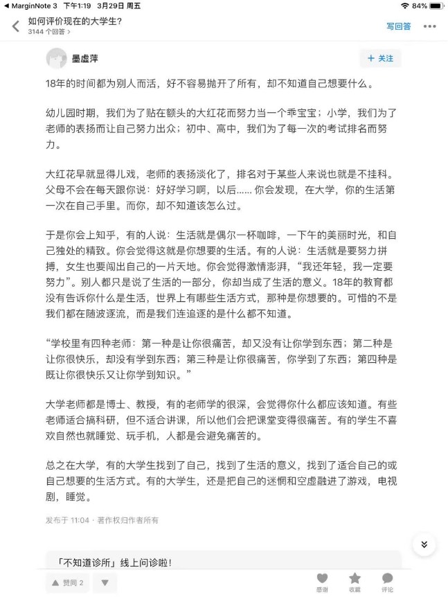

# 中小学时期的目标异化

作者：@zgq354 

## 理想的学习与成长

每个人是一个独立的个体，学习与成长是自己的事情。大体来说，是一个借助前人对世界的理解，在行动中对自然与社会建立认知、在其中找到属于自己的位置的过程。这个过程依赖个人的主观能动，也需要外界的力量的辅助，主要是家庭、学校、社会的共同支持。

个人的学习与成长，也伴随着主导角色逐步转移的过程。在小学的时候，个人认知水平与延迟满足能力都较为欠缺，家长与老师相对更占主导地位；随着人的成长，自我意识的萌发，个人思想也越来越复杂，外界（家长、老师）能决定的越来越少，学习也需要逐渐从被动灌输，过渡到自我主导的状态；到了大学阶段，个人的学习已应完全由自我为主导了，在主导的同时，逐步认识和融入社会，成为互相支撑的一份子。

## 学习成长 vs 资源竞争

以上描述的是较为理想的情况，然而现实并不像物理题里的小滑块，没有任何的现实阻力。现实而言，外界的学习辅助力量（包括硬件设施、老师、文化氛围等），也是其中重要的影响因素，我们可以将其统称为“教育资源”。在经济还未足够发达的当下，还伴随着有限的教育资源如何分配问题，我们中小学的学习也逐渐割裂为两件事：

1. 自我的学习与成长
2. 争取支撑自我学习、成长的教育资源

人口逐年上升，优质的教育资源的供给未能跟上时代的需求，在资源的分配上，竞争也越来越激烈。

激烈竞争下，家长和老师们的重心，渐渐偏离了学生自我的学习和成长，更多是把学生学习过程中部分能够量化和比较、可能决定资源分配优先级的指标 —— “小升初、中考、高考分数” 等作为了“最终目标”。

在目标的异化与人们的刻意追求之下，无形中家长和老师合力承担了其中本该学生承担的一部分成长的责任，背着教辅资料早已准备好的答案、结论，而鲜有学生自己由内而外的思考；乃至于揠苗助长，超前学习本不属于这一年龄段的知识体系，继续重复着前人既有的答案，内心的空洞逐渐放大，更进一步失去了深入思考问题本质的机会。

如《吾国教育病理》作者郑也夫教授所述：“过度复习是摧毁创造力的利器”，许多学生就这么陷入了一种考试驱动的被动灌输状态，习惯于在现成的轨道中重复重复，无暇主动思考背后是为什么。当这种状态逐渐成为思维定势，随着压力一年年增加，上述学习主导角色的转变的难度也越来越大。

## 高考后的第一道坎

对学生而言，在高考过后，原本简单的“考高分”的目标已经失去，该如何找到下一步的人生方向，如何准备新一轮的学习，可以说是一片空白，学生和家长们也一起陷入迷茫中。

受限于社会普遍的认知背景，许多家长和老师依然还继续沿用高考体系的“排名竞争”的思维模式去看待大学教育。在大学的新生群我们也常能看到类似“师资如何”、“教学如何”、“就业率如何”的重复问题，而鲜有类似“图书馆条件如何”、“交流氛围如何”这样的提问。

对于大学来说，大学还是那个关注学习本源的大学，它对学生素质的要求，还是上述所说的“自我主导的学习与成长”，并没有因为参加高考竞赛的人数的增加而有什么大的变化，反而还因竞争的加剧，学生的总体素质发生退化，脱节更加严重。

对即将迎接大学生活的新生而言，一个问题摆在面前：**经历着目标异化的中小学教育，如何回归学习的本源，与一名大学生应有的状态接轨起来？** 这成为了新生面对大学的第一道坎。

每个人内心的空洞程度不同，能否顺利跨越这一道槛，因人而异。有的人异化的程度很小，可能还没开学就已经迈过去了；有的人可能花了一两个学期乃至一两年的时间才意识到并付出行动；有的人，直到大学结束都未能意识到问题所在，继续埋头追逐着 GPA、竞赛、考/保研、考证等等可以量化和比较的指标；有的人则逃避思考，把时间交给了游戏、电视剧、睡觉，一直麻痹着自己，直到要面对社会，迎来当头一棒。

如今大学生的普遍状态，想必每一个过来人或多或少都有所体会，就如这个 [知乎帖子](https://www.zhihu.com/question/26452022/answer/635508898) 所言：

> 「好不容易抛开了所有，却不知道自己想要什么」  

《三联生活周刊》的一篇 [《顶尖高校：绩点考核下的人生突围》](https://0xffff.one/d/740-ding-jian-gao-xiao-ji-dian-kao-he-xia-de-ren-sheng-tu-wei)，也为我们描述了类似的困境。

那么，大学应该是什么样的？我们可以如何改善目前的现状？这也是「心态的转变」这一主题关注的话题。

## 参考链接
1. [如何评价现在的大学生？ - 知乎](https://www.zhihu.com/question/26452022/answer/635508898)
2. [顶尖高校：绩点考核下的人生突围 - 0xFFFF](https://0xffff.one/d/740-ding-jian-gao-xiao-ji-dian-kao-he-xia-de-ren-sheng-tu-wei)
3. [认识大学现状 - 中小学在学习目标上的异化](https://www.yuque.com/0xffff.one/cs-learning/current-situation#PFKRJ)
