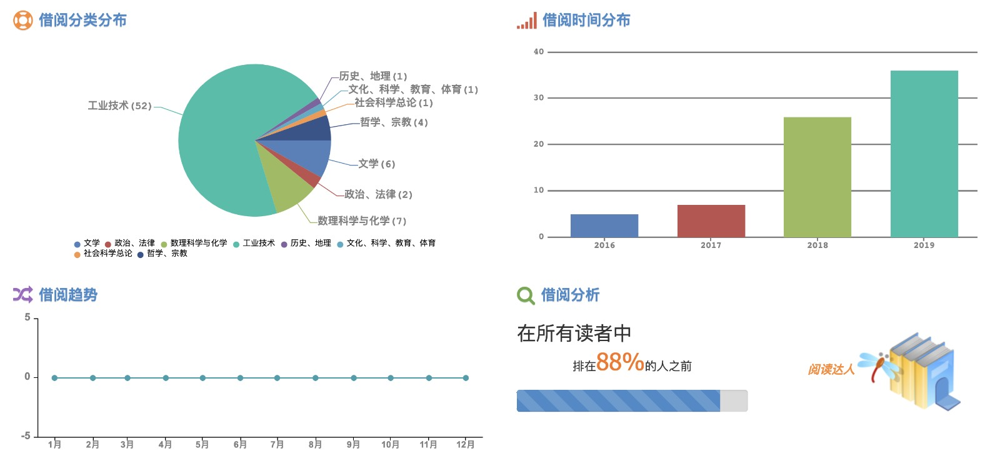

# 大学的理想与现实

作者：@zgq354 

上一章我们提到了「大学应该是什么样的」这个问题。从物理的角度来看，大学和中小学并没有太大的差别，看起来都是宿舍楼、图书馆、教学楼和各个院系的大楼。

它提供幽雅舒适的环境，为深处其中的人们的思考、交流和沉淀提供适宜的空间。同时提供了丰富的藏书与文献、快捷方便的网络等各种各样的学习资源。它招收老师和学生，也为其中学习、科研、工作的人们设立了各种各样的资源分配、毕业、升学等等机制。

乏味的介绍到此为止。问题来了，一所大学仅仅就是这些吗？大学与中小学存在差异，差异在哪里？分班和专业？“学术”背后究竟又代表什么？

## 大学的心灵世界本质

一直一来我也有在思考这方面的问题，在 [《禅与摩托车维修艺术》](https://book.douban.com/subject/6811366/) 这本书中发现了我认为是关于大学的十分准确的表述。

在《禅》书的观点下，真正意义上的大学，在于一个心灵的世界，它着眼于理性的自身，也是苏格拉底所认为的「真理」，当人们为了「真理」而投入到求知探索、投入到与他人之间交流、碰撞和沉淀之中的时候，真正意义上的大学便会出现。物理意义上的大学，是为了维持和发展这个心灵世界而存在的。

在这样心灵世界中的大学之中，认识自我、认识世界，在复杂又庞大的世界中找到合适自己的位置和继续奋斗的方向，为之做出努力，便是身处其中的人们的使命所在。

由此引出了一个话题，人们在大学追求的都是一种心灵的世界，物理意义上大学与大学的差异究竟体现在哪里呢？华师<small>（作者所在学校）</small>和中大、华工、南大、浙大、北大清华等有何差距？这里我也做一些简单的分析。

## 物理意义的“大学”

如开头所讲，物理意义上的“大学”主要提供了环境与资源，它和其中工作生活的师生的关系，或许可以类比为“土壤”和“植物”的关系，作为一个支持的角色存在；心灵世界的“理性思想”，则是大学这片“土壤”为“植物”所提供的“养分”的“核心成分”，前人留下的“养分”，大都汇聚于图书馆和互联网中。老师和同学在同一片“土壤”生长，在思维的碰撞与交流中，吸收养分的同时，产生更多的养分，让土壤更加“肥沃”。

“土壤”的建设需要投入大量的人力物力和财力，社会需要分工合作，生产、分配资源，也意味着需要一些量化指标、身份标签（title、学历）等构成的评价体系，以降低资源分配的决策难度。

当个人心中吸收的“养分”积累足够，在同行的认可下，便赋予具体的社会意义上不同等级的“学位” 标签。一所学校也需要一个 “品牌”，为其赋予的 “学位” 所代表的 “养分” 多少做一点背书。人际关系与社会层面，默认在“品牌”的学校获得 xx “学位” 的人，拥有相对应的“养分”和能力，以此降低建立信任的成本；当校友获得某些成就，进一步增强这一 “品牌” 的 “含金量”。这也是人们常说的 “文凭” 与 “人脉” 的形成过程，以及它背后蕴含的力量。

由此，物理意义上大学与大学之间的差异，量化的说便在于资源投入的多少，在社会中学校的 title 响亮程度（“211”、“985”、“双一流”、“清北”之类），取得 “院士”、“教授” 等等 title 的人数的多少，论文数量，影响力的大小之类等等的指标。一所量化指标层面做的足够优秀的学校，给决策者有更多的产出预期，获得资源投入的概率会更高，可以更多投入“土壤”的建设，能提供“养分”的概率就越高，某种意义上有一点“马太效应”。

在人际关系层面，学校与专业的 title，是一个最低成本的筛选工具。某种意义上来说，拥有一个好的学校专业 title，是一种环境给你带来的品牌光环。从社会竞争角度而言，这是一个有力的资源优势所在，意味着你可以更快地在人群中为你的能力与积累建立信任。

## 本科生学习的资源需求

上面的描述，对于在一所 title 层面不那么有优势学校的同学而言，可能有些残酷，这是我们难以直接改变的。

让我们跳出资源分配与争夺的视角，从最本源的学习看起，上一小节说到，与“植物”生长而言，“土壤”的贫瘠与肥沃，只是一个提供“养分”多少的问题。

当我们深入到心灵的层次的角度去看，大学的核心的任务是追求“真理”。不同大学之间的差别，更多是在于人们在其中探索自我、探索真理的过程中遇到的 **现实阻力** 的大小，以及在身边遇到同路人的 **概率**。

对于一名本科生而言，普遍思考的层次并不会太深，图书馆这么多的书一年都看不完几本，又如何触及到这方面探索的天花板？作者在华师四年，图书馆只借过几十本书，但也排到了88%之前：

由此来看，除去“社会地位”方面的因素，从一所大学对一名本科阶段的学生思考空间、以及能调动的资源的角度来看，大学之间的差异并不是很大。若内心有足够明确的方向，不同的学校对于个人的思考与探索的阻力并不会很大。

然而人的视野毕竟有限，一开始的懵懵懂懂，容易让人随大流而偏离的大学本来的目的，于是就有了另一个重要的因素，便是这所大学的人文环境能给学生带来多少积极影响。这里人文环境的影响，主要在于 **负责教学的老师**、还有身边的 **学术交流与沉淀的文化氛围**。

## 教学与交流氛围的缺位
目前的确有一个遗憾的现实。在大部分的大学，能如前文说到，真正能精心安排好课程的老师并不太容易遇到。在每个人有着巨大差异的背景下，教学的好坏很多时候缺少即时、客观的反馈，为此投入资源和精力通常无明显的回报。而老师普遍因为科研任务的压力，投入产出的权衡下，放在教学上的精力与时间也不多，也直接导致了大学课堂通常沉闷无趣，遇到好课程的概率较低。这方面的利益相关，只有学生本人；缺位之处，也只有学生默默承受。

在学生中的讨论交流的氛围方面，也需要有这方面的追求的人带领，然而在一个强调量化的环境，许多老师同学为了那些关系到生存的硬性指标的东西已经殚精竭虑，如果不是有着强烈的情怀和充沛的精力，是难以做到带领这样的氛围的存在的。于是一年又一年的大学生，继续被社会的浮躁、被资本市场的压力、title 等东西所裹挟。

这些东西也很难由一个在这里生活一两年的学生意识到和改变，同样，即使是意识到问题的存在，也因为将近大三大四，几乎要考虑投身社会或是读研深造，难以去推动这样的事情的进步。如《万历十五年》中所描述的，张居正的十年首辅生涯，不过只能是把明朝文官体制存在的问题看清楚，而自己在此之后已经无力改变，反而惹得一身骚。

一年又一年，学生们前仆后继地进入大学，经历着相似的迷茫。渐渐地，越来越多人在生活的裹挟而追求着短视的目标，土壤中仅存的“养分”越来越少，所谓“大学生”的头衔的光环也越来越弱，人们在感慨本科学历的含金量缺失，却又没有什么很好的办法改善。

本科生涯只有短暂几年，这几年又恰恰是人生中最关键的几年，面对问题的存在，被动依赖环境的改变并不现实，难道我们只能默默用短暂的靑春作为代价去承受这样教学与交流氛围的缺位？

显然，这么承受，始终都不是一个办法，所以我也在尝试着把我在这几年的挣扎的感悟记录于此，供后辈参考。希望能让你意识到，我们的“大学”并非如中小学时想象那般完美，依然有严重的现实问题亟待解决，这是你来到这里面临的第一个暗坑所在。

暗坑虽在，但情况还不算糟糕，目前针对这些问题的确还有一些可行且有效的解决方案。

## 应对缺位

刚刚有提到了不同的大学之间存在 title、教学水平、讨论氛围的差异所在，title 光环这个社会层面的不足，短期内我们只能通过考入拥有更好 title 的学校解决。而其它的自我发展相关的问题，在如今信息高度互联时代，这些问题实际上都可以有一些解决的思路。

### 资源开放融合的趋势

在授课资源上，如今的教学资源正走向一种开放与融合的趋势，能够让差距逐步缩小。正如中国大学 MOOC 的广告词一般：**好的大学，没有围墙**。通过 MOOC (大型开放式在线课程) 等方式，我们可以发现许多分散在各个大学的优质的课程资源，个体足够主动的情况下，我们仍然是有机会找到更合适的学习资源的。至于如何找到，这里需要的是互相的不断体验和踩坑和积累，为后人留下经验，如北大学生写下的 [csdiy.wiki](https://csdiy.wiki)，以及本 Wiki 也在做着相似的尝试。

在互联网的环境下，你所需要的，仅仅是一台电脑和一条能连通 internet 的网线，缺少的讨论交流氛围，可以通过互联网跨越时间与空间的距离来弥补，0xFFFF 社区便是这其中的一个尝试。在有条件的情况下，有相似兴趣的同学的定期面对面交流也是一个很好的补充（线下面聊，Zoom / 腾讯会议 等在线会议软件）。

在资源开放与共享的角度来看，计算机相关专业具有得天独厚的优势。不仅仅 MOOC 课程，得益于开放协议和开源社区，通过互联网开放的计算机相关的资源，可以说是比其它任何一个专业都要丰富。

### 大学的“泥淖”属性

如上文所言，如今现实许多“大学”也因为理性探索的气息太弱，在教学与交流的缺位、在社会浮躁气息裹挟之下，环境也变得不那么纯粹，潜意识混杂了并不太属于大学本身的价值观念。

当“土壤”的水分过多，在种种现实条件下，我们所面对的大学，也如烟台大学贺利坚老师在 [《逆袭大学》](https://blog.csdn.net/sxhelijian/article/details/85908097) 一书中的形容一般，就像一滩虽富有营养、但也危机四伏的“泥淖”，一不留神就可能深陷其中而难以自拔。

关于这滩泥淖，贺老师的书讨论了很多，总体来说，自我意识的觉醒，学会独立面对人生之路所遇到的问题，便是其中解药。在 **「独立面对」** 这个主题下，不少前人也为我们留下了许多的心得和经验的参考。

上海交大曾经流传过一份名为 [《上海交通大学生存手册》](https://survivesjtu.gitbook.io/survivesjtumanual/) 的文档，以下为其序言：

> 在上海交通大学的四年生活中，我目睹和经历了太多的荒谬，太多的错误，太多的茫然，太多的无奈，太多的失败。自诩为天之骄子的高中毕业生，站在大学的门槛上，有时竟会显得像低龄儿童一样幼稚。
>
> 年轻的同学们还为自己那充满无限可能的青春而沾沾自喜，却不曾意识到，一生仅此一张的白纸，绝不可以随意地涂抹。本书希望能为同学们树立正确的人生观和价值观，并在具体政策上，提供各种切实可行的建议，帮助同学里那一部分有志青年完善自我，实现内心的追求。
> 
> 回首四年大学时光，我一直保有一种强烈的对科学知识的虔诚。这份虔诚迫使我重新思考每天那本应“司空见惯”的生活；这份虔诚让我站出来，以我认为正确的方式贯彻自己的追求。
> 
> 在此，我把我这四年，和生活斗争的点点滴滴的经验和感悟记录下来。一方面，我希望我能为那些像我一样压抑中的灵魂尽一点义务。另一方面，也希望这本书本身，能成为推动各种不合理制度进步的一种动力。
> 
> 现实总是令人遗憾的。我们当中太多人已经习惯于沿着那一成不变的“典型成功道路”前进：中考，高考，考研，出国......数不清的人们在埋头赶路。走在前面的已然迷失，跟在后面的却还未开始思考。这不应该是一个国家、一个时代的精神。
> 
> 这本书不是《逃课手册》或者《考前突击宝典》。我希望帮助各位读者做到的，绝不是简单的拿高分、或者顺利毕业。我衷心希望这本书能够带给读者一些新鲜的思考，让同学们能看到人生道路上不同的风景。至少在读过本书之后，各位读者应该能够有勇气、有智慧，去发现并挑战那些比上课更为重要的追求。

从文档中可见，即使上海交大这样 Top 的高校，依然和我们一样，面临着相似的困境，等待体制的改变是漫长的。今年是 2022 年，距离交大的这本小册子第一版的发表已过去14年，问题依然还存在。人生大学阶段仅有短暂几年，等待于我们个人而言并不现实，各种各样的成长与发展的问题，还非常需要我们来到大学的每一位新成员去主动面对。

人作为一种后知后觉的动物，一开始确实难以意识到这一点。当面对大学的种种责任无形中转到了个人身上以后，在最初没跨过槛的过程中的迷茫之下。若继续过去的被动思维，没有自我的主动，则很容易会被环境的潜移默化所左右。

某种意义上来说，[贺老师的博客](https://helijian.blog.csdn.net/article/details/8135028)、《逆袭大学》、Bintou 老师的 [博文](https://www.yuque.com/bintou/ba6cwk)、还有《上海交通大学生存手册》、和我这里关于大学存在的问题的表述，可以说是殊途同归，再躺一轮相似的坑大可不必。也如王小波写给柯云路的信 [所言](https://www.weibo.com/1496070307/I2k49hBHb)：

> 近代以来，科学有很大的成就，任何人想要有所创新，总要从学习开始。

时间短暂，大学的探索并非要把自我抽离出来单打独斗，吸纳前人有益经验，也很有必要。一同去正视大学的“泥淖”，趟坑经验一代代人传承和积累下来，慢慢地后人走弯路的情况也将越来越少。

### 个体的有限性

一个人的视野始终是有限的，一般来说只能注意到自己认知圈层范围内的东西，著名的 **邓巴数字**（150 定律）为我们描述了一个人所能维系稳定社交关系的人数上限，大约在 150 左右，紧密联系的人大概只有 20 上下，相比而言，一般一个班级已有 40+ 人、一个年级就已有两三百人，在放眼望去，活跃于网络的人群成千上万甚至上亿。世界之大，我们认知范围内的圈子，只是茫茫人海中渺小的一部分。

这也意味着，我们其实有机会去选择我们所在的环境的，只需利用好类似的规律，无形中会完成筛选。最核心的是，保持着一颗主动探索的心，去追求心中的理性与科学部分的存在。

来到大学，是在“求学”，而不是“等老师求我们学习”。当你拥有这样的心态，那些在现实大学环境带来阻力的事可能并不会带来多大阻碍。当一个人开始从内而外的主动，一切的类似于师资、志同道合的朋友等等的占比问题，实际只剩下一个遇见的概率的问题。如今的人与人之间的触达越来越高效，遇见理想氛围的概率实际上会越来越高。

当你足够坚定，可以很容易形成一个志同道合的新的圈子，因此并不必太担心氛围的问题，只需专注做好眼前的事即可，“明确的方向和目标 + 链接人与知识的网络” 会成为你在复杂世界里的一个很好的过滤器。

## 参考链接
1. [认识大学现状 - 我们面对的大学是什么样子](https://www.yuque.com/0xffff.one/cs-learning/current-situation#xa3ci)
2. 关于 “土壤” 的脑洞：[华南师范大学计算机怎么样？ - 知乎](https://www.zhihu.com/question/276894447/answer/1359676100)
3. “真正的大学”：[《禅与摩托车维修艺术》读后感 - 阮一峰的网络日志](https://www.ruanyifeng.com/blog/2011/12/zen_and_the_art_of_motorcycle_maintenance.html)
4. [《禅与摩托车维修艺术》 - 豆瓣](https://book.douban.com/subject/6811366/)
5. [CS自学指南 | csdiy.wiki](https://csdiy.wiki/)
6. [《逆袭大学》 - 贺利坚](https://blog.csdn.net/sxhelijian/article/details/85908097)
7. [《上海交通大学生存手册》](https://survivesjtu.gitbook.io/survivesjtumanual/)
8. [Bintou老师的博客 · 语雀](https://www.yuque.com/bintou/ba6cwk)
9. [王小波：致柯云路 -《爱你就像爱生命》](https://www.20dcr.com/book/ainijiuxiangaishengming/693048.html)
