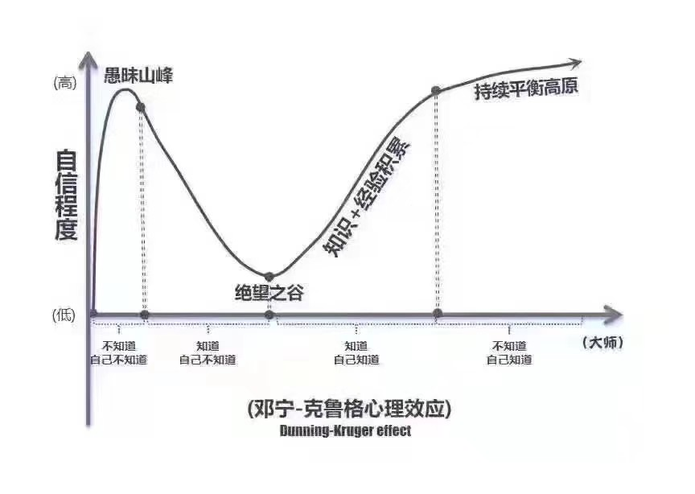

# 进入大学的心态准备

作者：@zgq354

前面的章节，对大学在学习方面所面临的严峻现实，以及计算机学生破局可以加以利用的一些资源，做了一个基本的勾勒。这一小节，主要也是展开聊聊，作为一名大学生，在心态上需要做好的准备。

也如上一节关于知识网络的描述所言，这一切的出发点也在于，保持一种 **对理性、科学知识的虔诚，以及对真理的不懈追求**，具体展开而言，大致有几个主题：

1. 独立面对
2. 理想与现实的平衡
3. 对未知探索建立信心
4. 有涯人生与无涯的知识网络的把握
5. 总结与沉淀的意识

## 逐渐适应「独立面对」的状态

前面章节有提到，学习与成长是自己的事情，别人都无法代替你的成长。世界并不是理想的小滑块，未来的你可能会有许多不尽人意的事，但没有任何人有义务和能力去为你化解这些事情，帮你背负成长的责任。**独立面对**，去适应身边的环境，付诸行动解决自身的困惑和问题，争取让自己的收获最大化，某种意义上也是你在当下的唯一选择。

如《被讨厌的勇气》提到的“课题分离”原则一般，每个人都有属于自己的人生课题，许多的问题和烦恼，也是来源于你自己的课题被加以干涉，或将自己的课题强加于他人。独立面对，意味着自己需要获得自己人生课题的主动权，不再幻想问题会自动消失，并付出现实的行动。

这也是从中小学时期普遍的「被动灌输」到大学生应有的「主动探索」的第一步转变。

## 理想与现实的平衡

在独立面对的原则下，在日常的活动中，给自己留下专注与思考的空间，把握好自我与外界接触的平衡，也变得重要了起来。

现实并不完美，我们在探索这个不完美世界的过程中，常会遇到许多迫不得已要花时间做的事情。如《上海交大学生生存手册》中举的例子：效率低下的课、毫无组织的集体活动、难以推脱的临时工作等等。若没有自我的主动，在不太理想的环境里，容易因为人云亦云，陷入各种细枝末节的琐碎中，难以解脱。

当然，这样的现象也有其现实背景。如第一节所言，大学“土壤”的建设背后是大量资金投入，类似欧美相对理想的大学氛围，背后需要的费用是不菲的，本科阶段需要付出20万美元上下<small>（数据还待补充）</small>；大陆高校的建设费用，更多来自于国家的教育经费投入、科研收入、教育培训收入等，一般本科生学杂费住宿费加起来基本在5万人民币上下（部分学校可能10万左右），与欧美等高校相比而言并不在一个量级。更多时候我们是接收到了相对更普惠的高等教育，体验上很难抱太多理想的预期。

如前面章节所言，遇到问题，并不意味着只能默默忍受，接纳现实的同时，从资源、氛围来看还是有机会破局的：

1. 学习资源：结合互联网与开源社区，可以实现课内安排课外学习的双线并行
2. 氛围：利用个体必然的局限性与信息差，构建起志同道合的学习小组

我们的社区也正是如此的定位，希望可以在资源和氛围视角，在线上创造一个相对理想的形态，并为之提供行之有效的方法，可以支撑起这个领域的学习。

当然互联网并不能代替生活的全部，理想没有一个现实的触达，只会停留在空中楼阁里停滞和闭塞。于我们而言，面对各自的现实生活，有很多问题需要考虑。

一方面是时间计划的平衡，考虑相对理想的在线课程与现实可能不是太完美的授课的一个结合，如果有机会，尽可能多与身边任课老师，辅导员沟通交流自己的计划，寻求行政层面的支撑和减小阻力。总的而言，至少应保证 GPA 在一定水平，避免不必要的挂科，影响未来的选择。

另一方面是关注线下氛围的构建，而非停留在互联网上，无论学习、生活、工作，若身边能有一些伙伴相互支撑，会是更好的状态。

## 对未知探索保持信心

### 面对未知的勇气

计算机领域的学习与工作中，经常需要一种学习新事物的状态。我们过去的应试教育压力下的成长中，许多事情早已有安排，可以给到预期说“完成本课程，一定会学会”。但对于课本和老师讲解预期之外的东西，常常是一个不敢行动、缺乏勇气独立承担选择带来的风险的状态。

在这样的背景影响下，在面对一个新的未知领域的开始，有的人可能下意识就打起了退堂鼓，因为听说某些只言片语，提前下了一个结论：“这个好难啊，我肯定不懂”，否定了进一步的可能性。这也是一个常见的现象，在老舍的《四世同堂》中有一段类似的描述：

> 生在某一种文化中的人，未必知道那个文化是什么，像水中的鱼似的，他不能跳出水外去看清楚那是什么水。假若他自己不能完全客观的去了解自己的文化，那能够客观的来观察的旁人，又因为生活在这种文化以外，就极难咂摸到它的滋味，而往往因一点胭脂，断定他美，或几个麻斑而断定他丑。

难与不难的判断，也常因为这样的下意识恐惧而断定了。也恰恰是这样的断定，而让我们拒绝了许多东西，否定了人生更多的可能性。小学时我们便学过 [“小马过河”](https://www.ppzuowen.com/book/baobaoshuiqiangushidaquanji/164357.html) 的故事，可惜的是，到了大学，我们许多人仍然还继续犯着类似的谬误。

这样的自信不足，主要来源于个体对陌生事物的 **“不配得感”**，主要因为身份认同的因素而下意识 “画地为牢” 的心态。实际上来说，我们学习东西，总会有一个自信心逐步崩塌，从迷雾中逐步走出的过程，这个现象有个概念是 “邓宁·克鲁格心理效应”，对应一个曲线。

这其实是一个正常现象，面临恐惧，最好的办法还是增加信息量。在计算机领域，Web 与开源社区，也在克服恐惧所需信息方面给了我们非常强大的底气，理论上来说，我们不应该失去信心的。

道理都懂，要真正地达成，有时可能还需要一个体悟的过程。于新手而言，可以尝试去挑战一些难度相对较轻的任务，多经历和感受几次从绝望之谷慢慢走出来的感觉，给自己多一点勇气；勇气的逐步积累下，自身的一些 “面对未知的霸气” 的 “学霸” 气质也因此得以培育起来。

关于“学霸”的“重新定义”，可以看 Bintou 老师的帖子 [“你是否需要做学霸？”](https://0xffff.one/d/60-ni-shi-fou-xu-yao-zuo-xue-ba)。

### Peer Pressure

与此 “不配得感” 伴生另一个较普遍问题，来自于 Peer Pressure 带来的 “压迫感”。

过去中小学强调面向学习资源竞争的学习中，我们常常需要和周围的人比较，以排名来判断“进步”/“退步”，也以成绩排名的方式，去区分班级、老师的重视程度等。以至于当身边有同学取得了某种成就，心中不觉也带来一种“地位被挑战”的压迫感。这样的压迫感也使很多人难再有一颗开放分享的心态，亦或是被“打击”之下的压抑感觉，长此以往带来的更多的是上述持续的不自信。

脱离了中小学的竞争体系后，实际上相比于类似高考、考研、保研的切蛋糕游戏而言，更需要的是一种多方共赢的思维，把蛋糕做大。

打开视野，大学的出路并非只有考研、保研等固定的赛道，每个人都拥有自己的独特，换句话说每个人都是自己的 No.1。即使看似懂很多的人，也未必能够面面俱到，可能唯一的优势在于他获得了某些现实赛道认可带来的自信心。在这个背景下，不自信更多时候是自己给自己的一点“幻象”带来的枷锁。

一切的核心在于内心的积累，不妨给自己多一些沉住气的空间。如「冰山模型」，当你积累到一定程度，突破到了水面上可以被他人看见的程度的时候，收获现实中所谓赛道的认可，只是降维打击下的顺便事情。也许有机会你还可以创造出更多的“赛道”呢。

更多的讨论可见：[关于同辈压力 (Peer Pressure)](https://0xffff.one/d/610-guan-yu-tong-bei-ya-li-peer-pressure)

当你足够自信地表达自我时，别忘了给身边可能陷入 Peer Pressure 幻象的人，多传递一些鼓励和信心。

## 生而有涯 vs 信息爆炸

（施工中）

保持内心的积累

问题：
早早地让我们还未有积累的时候，就接触了更复杂的世界
推荐算法等带来的的困局

心态：
弱水三千，只取一瓢饮
从自我出发
进一寸有一寸的欢喜

抓住核心主干
深度与广度问题，关注深度
找准自己深耕的技术栈、方向

信息素养意识、技能训练

## 总结、沉淀意识

（施工中）

记录：在网状的知识结构中建立一些回忆的锚点
信息、知识管理问题
费曼学习法：更好地消化知识

交流也由此出发

## 多多交流，走向「共同面对」

（施工中）

每个人的视野都有限，多个视角的碰撞
打破思维定势
