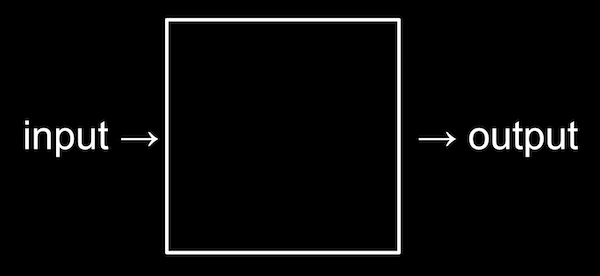

# intro
算法（Algorithm）属于计算机学习中的重要能力之一，计算机核心在于解决问题，一个问题有确定的输入、输出，问题处理的过程如何设计和实现，便属于算法的范畴。

算法与工程能力相辅相成，构成了计算机学习中的两大重点关注的能力。

但在我们的语境下，「算法」的概念通常分化到一些特定的领域，人人谈算法，但谈的并不是一个东西，B站 Up 【湾区书记汤姆】为此做了一个 [归纳](https://www.bilibili.com/video/BV1br4y1z784/?p=1)，Wiki 的这一 part 我们也按照这样的分类去组织接下来的内容和学习的指路。  

目前（2022年初）我们所讨论的「算法」主要分化为以下几种：

1. 算法核心：参见 [专业核心/数据结构与算法](/category/data-structures-and-algorithms)
2. 算法竞赛：参见 [程序设计竞赛](/subdivision/algorithm-application/programming-contest)
3. 面试算法：参见 [算法面试](/subdivision/algorithm-application/job-interview)
4. 日常工作使用算法（待完善，考虑常见开源项目对算法的使用）
5. AI 向算法（神经网络、机器学习等）

当然，这里只是侧重关系，并非割裂的状态，结合起来看。

（目前仍施工中，待完善，欢迎你的贡献 👏）

社区相关讨论帖：[算法 - 0xFFFF](https://0xffff.one/t/algorithm)
